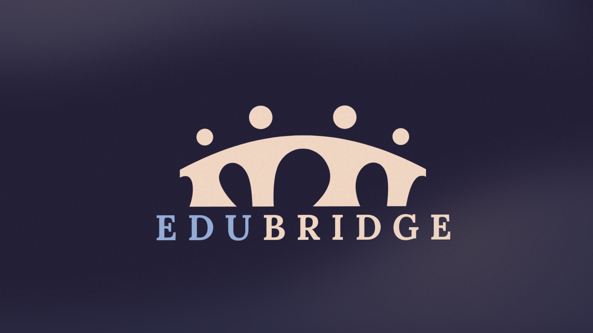

# EduBridge

<p align="center">
  
</p>

<p align="center">
  <strong>Bridging the gap between students, educators, and project opportunities.</strong>
</p>

---

## 🌟 Overview

EduBridge is a comprehensive ecosystem designed to streamline coordination within academic environments. It empowers students to find project ideas, form teams, and seek professional supervision from Teaching Assistants (TAs), all while providing educators with the tools to manage and track research progress seamlessly.

### 🎯 Objective
To create a unified platform that eliminates the administrative friction in graduation projects and research coordination, fostering a culture of collaboration and innovation.

## ✨ Key Features

- 📑 **Idea Library**: Browse and save high-impact project concepts with detailed technology stacks and categorizations.
- 👥 **Team Management**: Form teams, invite members, and manage roles within a dedicated workspace.
- 👨‍🏫 **TA Supervision**: Direct request-to-approval workflow for project mentoring and academic supervision.
- 🔍 **Unified Search**: Instant filtering across Users, Teams, Ideas, and TAs using a fast, centralized search component.
- 🔔 **Real-time Notifications**: Custom notification system for team invites, request status updates, and milestones.
- 🤖 **AI Support**: Integrated Chatbot for instant platform guidance and project assistance.
- 🌗 **Dark Mode & Theming**: Full glassmorphism UI supporting both light and dark modes with branded aesthetics.

## 🛠️ Tech Stack

- **Frontend**: [React 19](https://react.dev/) + [React Compiler](https://react.dev/learn/react-compiler)
- **Build Tool**: [Vite 8](https://vitejs.dev/)
- **Language**: [TypeScript](https://www.typescriptlang.org/)
- **Styling**: [Tailwind CSS v4](https://tailwindcss.com/)
- **Components**: [shadcn/ui](https://ui.shadcn.com/) + [Lucide React](https://lucide.dev/)
- **State Management**: [Zustand](https://github.com/pmndrs/zustand)
- **Animations**: [Framer Motion](https://www.framer.com/motion/)
- **Routing**: [React Router 7](https://reactrouter.com/)

## 🚀 Getting Started

### Prerequisites

- Node.js (v20 or higher)
- npm or pnpm

### Installation

1. **Clone the repository:**
   ```bash
   git clone https://github.com/LoaiWael/EduBridge.git
   cd EduBridge
   ```

2. **Install dependencies:**
   ```bash
   npm install
   ```

3. **Start the development server:**
   ```bash
   npm run dev
   ```

4. **Build for production:**
   ```bash
   npm run build
   ```

## 📂 Architecture

```text
src/
├── assets/          # Static images, icons, and SVG illustrations
├── components/      # Reusable global UI components (Search, NavBar, etc.)
│   └── ui/          # base shadcn primitives
├── data/            # Mock JSON data for users, teams, and ideas
├── features/        # Feature-based module organization
│   ├── auth/        # Login, Register, Session management
│   ├── ideas/       # Library browsing and detail views
│   ├── profile/     # User profile and settings
│   ├── teams/       # Team creation and member management
│   ├── supervision/ # Request handling for TAs
│   └── notifications/
├── layouts/         # Layout wrappers (Root, WithoutNav)
├── pages/           # High-level route components
├── router/          # React Router configuration and guards
└── store/           # Global Zustand store definitions
```

## 🤝 Contributing

We welcome contributions! If you have ideas for features or find bugs, please:

1. Fork the repo.
2. Create your feature branch (`git checkout -b feature/AmazingFeature`).
3. Commit your changes (`git commit -m 'Add some AmazingFeature'`).
4. Push to the branch (`git push origin feature/AmazingFeature`).
5. Open a Pull Request.

## 📄 License

This project is private and intended for educational purposes at Mansoura University.

---
<p align="center">
  Developed with ❤️ by <a href="https://github.com/LoaiWael">Loai Wael</a>
</p>
